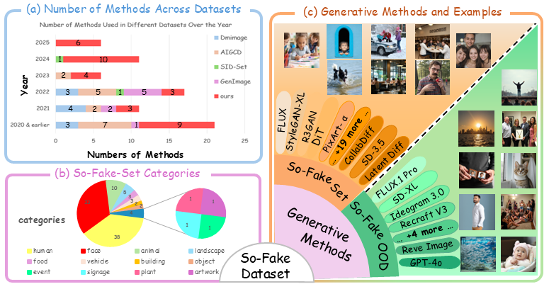
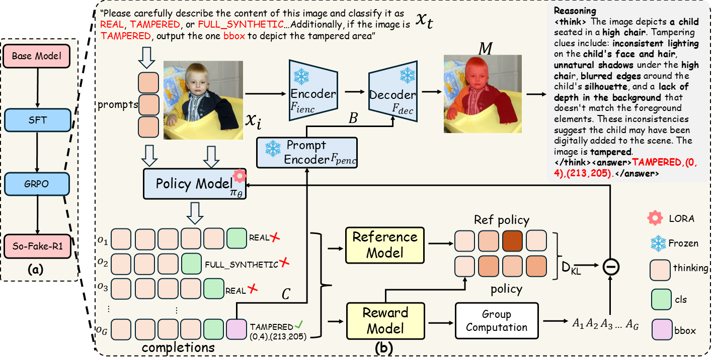

<div align="center">
<h3> So-Fake: Benchmarking and Explaining Social Media Image Forgery Detection </h3>

  <p align="center">
    <a href=''>
       </a>
    <a href='https://hzlsaber.github.io/projects/So-Fake/' style='padding-left: 0.5rem;'>
       </a>
    <a href='' style='padding-left: 0.5rem;'>
       </a>
    <a href='https://huggingface.co/datasets/saberzl/So-Fake-OOD' style='padding-left: 0.5rem;'>
      
    <a href='https://www.youtube.com/embed/ZSShvDB94pc' style='padding-left: 0.5rem;'>
       </a>
  </p>
</div>


[Zhenglin Huang](https://scholar.google.com/citations?user=30SRxRAAAAAJ&hl=en&oi=ao), [Tianxiao Li](https://tianxiao1201.github.io/), [Xiangtai Li](https://lxtgh.github.io/), [Haiquan Wen](https://orcid.org/0009-0009-3804-6753), [Yiwei He](https://orcid.org/0000-0003-0717-8517), [Jiangning Zhang](https://www.researchgate.net/profile/Jiangning-Zhang), [Hao Fei](https://haofei.vip/),[Xi Yang](https://scholar.google.com/citations?user=ddfKpX0AAAAJ&hl=zh-CN),
[Bei Peng](https://beipeng.github.io/), [Xiaowei Huang](https://cgi.csc.liv.ac.uk/~xiaowei/), [Guangliang Cheng](https://sites.google.com/view/guangliangcheng/homepage)


## Abstract
Recent advances in AI-powered generative models have enabled the creation of increasingly realistic synthetic images, posing significant risks to information integrity and public trust on social media platforms. While robust detection frameworks and diverse, large-scale datasets are essential to mitigate these risks, existing academic efforts remain limited in scope: current datasets lack the diversity, scale, and realism required for social media contexts, while detection methods struggle with generalization to unseen generative technologies.

To bridge this gap, we introduce **So-Fake-Set**, a comprehensive social media-oriented dataset with over **2 million** high-quality images, diverse generative sources, and photorealistic imagery synthesized using 35 state-of-the-art generative models. To rigorously evaluate cross-domain robustness, we establish a novel and large-scale **(100K)** out-of-domain benchmark **(So-Fake-OOD)** featuring synthetic imagery from commercial models explicitly excluded from the training distribution, creating a realistic testbed for evaluating real-world performance.

Leveraging these resources, we present **So-Fake-R1**, an advanced vision-language framework that employs reinforcement learning for highly accurate forgery detection, precise localization, and explainable inference through interpretable visual rationales. Extensive experiments show that So-Fake-R1 outperforms the second-best method, with a 1.3% gain in detection accuracy and a 4.5% increase in localization IoU. By integrating a scalable dataset, a challenging OOD benchmark, and an advanced detection framework, this work establishes a new foundation for social media-centric forgery detection research.

## News
- 🔥 (23-05-2025) We are pleased to announce the release of [So-Fake-OOD](https://huggingface.co/datasets/saberzl/So-Fake-OOD).


## Overview

<div align="center">
  
    <figcaption><strong> Overview of So-Fake Dataset.</strong> (a) Comparison of forgery detection methods from 2020 to 2025 shows our dataset includes the most recent and the largest number of methods. 
              (b) So-Fake-Set covers diverse real social media scenarios, including 12 different categories. 
              (c) Different generative methods and visual examples in <strong>So-Fake-Set</strong> and <strong>So-Fake-OOD</strong>.</figcaption>
</div>

## Method
<div align="center">
    
    <figcaption> (a): Overview of the <strong>So-Fake-R1</strong> training process; \textbf{(b)}: The detailed <strong>So-Fake-R1</strong> GRPO training process. The example shows a tampered image where a boy has been manipulated.  </figcaption>

</div>

## Generative Methods

<div align="center">
      <figcaption> Details of generative methods used in constructing <strong>So-Fake-Set</strong>strong> and <strong>So-Fake-OOD</strong>strong>. Column abbreviations: Set = So-Fake-Set, OOD = So-Fake-OOD, F = fully synthetic images, T = tampered images. Real data source abbreviations: F30k = Flickr30k, OI = OpenImages, OF = OpenForensics.
  </figcaption>
    


</div>


## Citation 

```
@misc{huang2025sidasocialmediaimage,
      title={SIDA: Social Media Image Deepfake Detection, Localization and Explanation with Large Multimodal Model}, 
      author={Zhenglin Huang and Jinwei Hu and Xiangtai Li and Yiwei He and Xingyu Zhao and Bei Peng and Baoyuan Wu and Xiaowei Huang and Guangliang Cheng},
      year={2025},
      booktitle={Conference on Computer Vision and Pattern Recognition}
}
```
