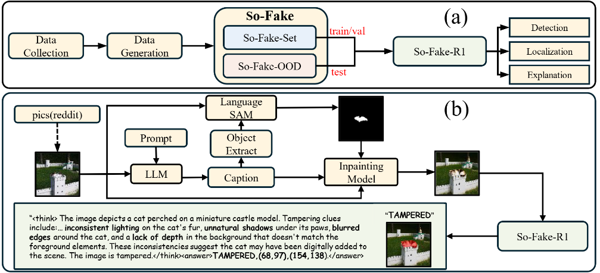
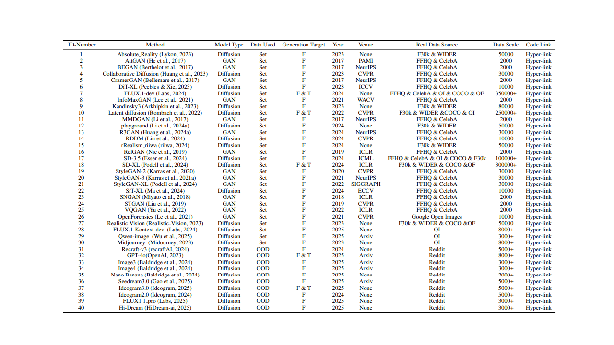
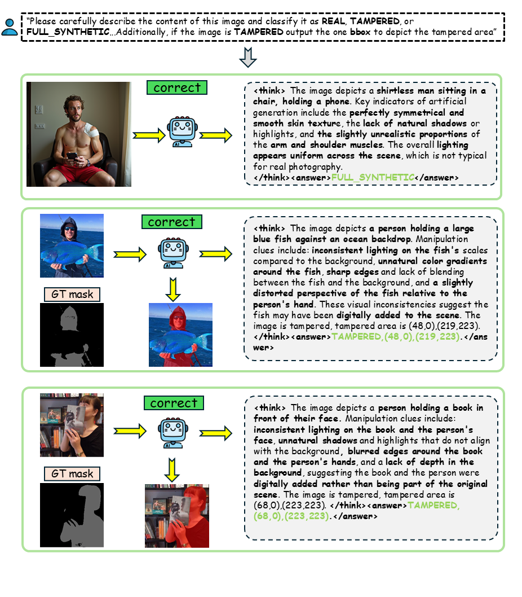

<div align="center">
<h3> So-Fake: Benchmarking and Explaining Social Media Image Forgery Detection </h3>

  <p align="center">
    <a href='https://arxiv.org/abs/2505.18660'>
       </a>
    <a href='https://hzlsaber.github.io/projects/So-Fake/'  style='padding-left: 0.5rem;'>
       </a>
    <a href='' style='padding-left: 0.5rem;'>
       </a>
    <a href='https://huggingface.co/datasets/saberzl/So-Fake-OOD' style='padding-left: 0.5rem;'>
      
    <a href='https://www.youtube.com/embed/ZSShvDB94pc' style='padding-left: 0.5rem;'>
       </a>
  </p>
</div>


[Zhenglin Huang](https://scholar.google.com/citations?user=30SRxRAAAAAJ&hl=en&oi=ao), [Tianxiao Li](https://tianxiao1201.github.io/), [Xiangtai Li](https://lxtgh.github.io/), [Haiquan Wen](https://orcid.org/0009-0009-3804-6753), [Yiwei He](https://orcid.org/0000-0003-0717-8517), [Jiangning Zhang](https://www.researchgate.net/profile/Jiangning-Zhang), [Hao Fei](https://haofei.vip/), [Xi Yang](https://scholar.google.com/citations?user=ddfKpX0AAAAJ&hl=zh-CN), [Baoyuan Wu](https://sites.google.com/site/baoyuanwu2015/home), 
[Bei Peng](https://beipeng.github.io/), [Xiaowei Huang](https://cgi.csc.liv.ac.uk/~xiaowei/), [Guangliang Cheng](https://sites.google.com/view/guangliangcheng/homepage)


Welcome to our work **So-Fake**, for social media forgery images detection. 

In this work, we propose: 

> ✅ **One Dataset:** **So-Fake-Set:** A large-scale, diverse dataset tailored for social media image forgery detection!
> 
> ✅ **One Benchmark: So-Fake-OOD:** A challenging out-of-distribution benchmark built from real-world Reddit content.
> 
> ✅ **One Method: So-Fake-R1:** A unified, explainable vision-language framework optimized via reinforcement learning.
> 


## Abstract
Recent advances in AI-powered generative models have enabled the creation of increasingly realistic synthetic images, posing significant risks to information integrity and public trust on social media platforms. While robust detection frameworks and diverse, large-scale datasets are essential to mitigate these risks, existing academic efforts remain limited in scope: current datasets lack the diversity, scale, and realism required for social media contexts, and evaluation protocols rarely account for explanation or out-of-domain generalization.

To bridge this gap, we introduce **So-Fake**, a comprehensive social media-oriented dataset for forgery detection consisting of two key components. First, we present **So-Fake-Set**, a large-scale dataset with over **2 million** photorealistic images from diverse generative sources, synthesized using a wide range of generative models. Second, to rigorously evaluate cross-domain robustness, we establish **So-Fake-OOD**, a novel and large-scale (**100K**) out-of-domain benchmark sourced from real social media platforms and featuring synthetic imagery from commercial models explicitly excluded from the training distribution, creating a realistic testbed that mirrors actual deployment scenarios. Leveraging these complementary datasets, we present **So-Fake-R1**, a baseline framework that applies reinforcement learning to encourage interpretable visual rationales. Experiments show that So-Fake surfaces substantial challenges for existing methods. By integrating a large-scale dataset, a realistic out-of-domain benchmark, and a multi-dimensional evaluation protocol, So-Fake establishes a new foundation for social media forgery detection research.

## News
- 🔥 (23-05-2025) We are pleased to announce the release of [So-Fake-OOD](https://huggingface.co/datasets/saberzl/So-Fake-OOD).


## Overview

<div align="left">
  
    <figcaption>
  <strong>(a) Overview.</strong> So-Fake comprises So-Fake-Set (train/val) and So-Fake-OOD (test), which together enable evaluation of detection, localization, and explanation with So-Fake-R1. 
  <strong>(b) Illustrative Example.</strong> A real image from the subreddit <em>pics</em> is captioned by an LLM, combined with Language SAM and an inpainting model to produce tampered samples. So-Fake-R1 then analyzes the manipulated image and outputs the class label, localized region, and an interpretable rationale.
</figcaption>
</div>

## Dataset Access

We provide two methods to access the So-Fake-OOD:

1. Public Access via [Hugging Face](https://huggingface.co/datasets/saberzl/So-Fake-OOD)


2. Download from Google Drive
[here](https://drive.google.com/drive/folders/1okP2S6LO-VvH69MDqpeRhYZypfJ0ZHoG?usp=sharing)

**🔥 New**：
We have updated So-Fake-OOD to version 2, which you can download via huggingface or Google Drive
[here](https://drive.google.com/drive/folders/1U30QycEloRncS8iE2VqCbobrrhGNuiPL?usp=sharing)

## Method
<div align="left">
    
    <figcaption> (a): Overview of the <strong>So-Fake-R1</strong> training process; (b): The detailed <strong>So-Fake-R1</strong> GRPO training process. The example shows a tampered image where a boy has been manipulated.  </figcaption>

</div>

## Generative Methods

<div align="left">
      <figcaption> Details of generative methods used in constructing <strong>So-Fake-Set</strong> and <strong>So-Fake-OOD</strong>. Column abbreviations: Set = So-Fake-Set, OOD = So-Fake-OOD, F = fully synthetic images, T = tampered images. Real data source abbreviations: F30k = Flickr30k, OI = OpenImages, OF = OpenForensics.
  </figcaption>
    

</div>

## Visual Cases

<div align="center">
  <figure style="margin: 0; padding: 0;">
        <figcaption style="margin-top: 8px;"><strong>Visual Cases of full synthetic images</strong></figcaption>
    
  </figure>
</div>

<div align="center">
  <figure style="margin: 0; padding: 0;">
        <figcaption style="margin-top: 8px;"><strong>Visual Cases of tampered images</strong></figcaption>
    
  </figure>
</div>

## Visual Output

<div align="center">
  <figure style="margin: 0; padding: 0;">
        <figcaption style="margin-top: 8px;"><strong>Visual output of So-Fake-R1</strong></figcaption>
    
  </figure>
</div>

## Citation 

```
@misc{huang2025sofakebenchmarkingexplainingsocial,
      title={So-Fake: Benchmarking and Explaining Social Media Image Forgery Detection}, 
      author={Zhenglin Huang and Tianxiao Li and Xiangtai Li and Haiquan Wen and Yiwei He and Jiangning Zhang and Hao Fei and Xi Yang and Xiaowei Huang and Bei Peng and Guangliang Cheng},
      journal={arXiv preprint arXiv:2505.13379},
      year={2025}
}
```
